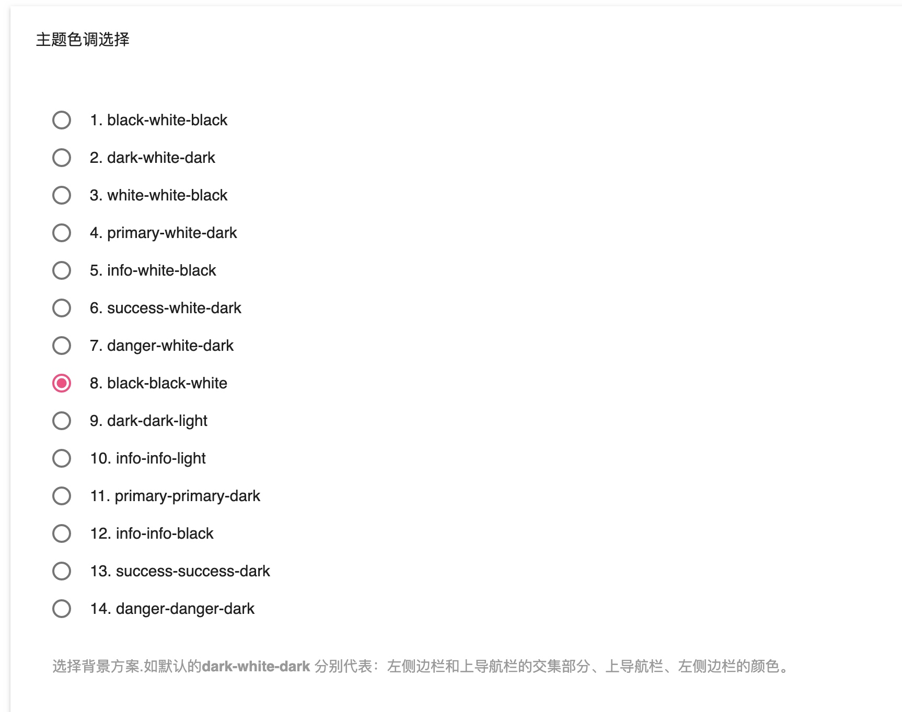

# 主题外观配色指南

主题支持单栏、双栏、三栏。

主题布局非常丰富，通过后台的外观设置，轻松搭配不一样的博客风格。


## 布局

### 单栏——极简模式


* 外观设置——置顶导航 开启（最侧边栏置顶）
* 外观设界面——页面元素显示设置——右侧边栏元素控制——不显示整体（不显示右侧边栏）

### 双栏模式

上面的两个操作执行一个即可

### 三栏模式

默认，显示更多的信息

## 配色

### 选择

在外观设置——主题色调选择，可以看到主题默认内置了14种配色。

如默认的`dark-white-dark`分别代表：「左侧边栏和上导航栏的交集部分（logo位置）」、「上导航栏」、「侧导航栏」。




### 自定义


#### 主题色调自定义搭配

已有的颜色（后续考虑提供更多的配色）:

* `black`纯黑色
* `white`白色
* `info`蓝色
* `success`绿色
* `danger`深红色
* `dark`深色
* `light`灰白色
* `primary`紫色

其中`dker` 表示当前颜色增强


搭配样例：

全白配色即填写：

```
white-white-white 
```
其他配色举例：

```
white-white-white 
white dker-white-white
dark-light-light
```

分别代表：「左侧边栏和上导航栏的交集部分（`logo`位置）」、「上导航栏」、「侧导航栏」的颜色。


